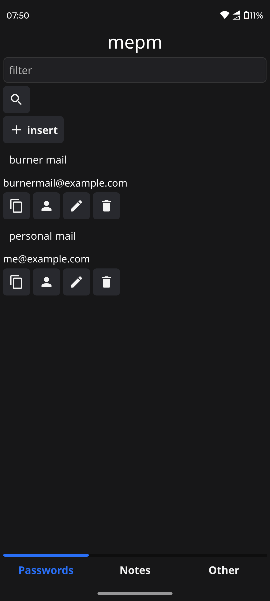
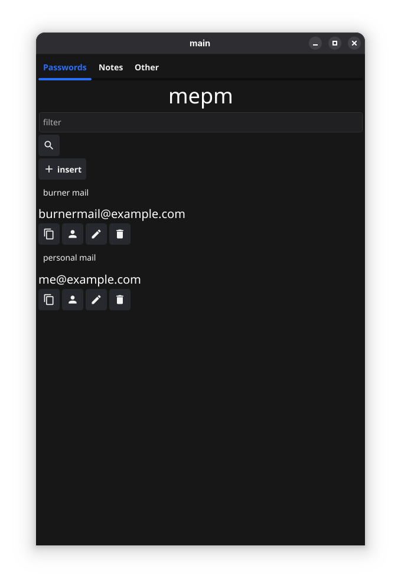

# Mepm

Simple password manager written  In Go + fyne GUI framework. This application can be use on all major platforms. It was tested on Linux and Android.

App is under heavy development, and it may never be finished !!!
## Todos

Security:
- [x] encryption / decryption
- [x] key generation
- [x] salt generation

Db:
- [x] created models for password and note
- [x] insert, update, delete for password
- [ ] insert, update, delete for note

Gui:
- [x] password insert screen
- [x] password edit screen
- [x] delete password
- [ ] note insert screen
- [ ] note edit screen
- [ ] delete note

## Screenshots

